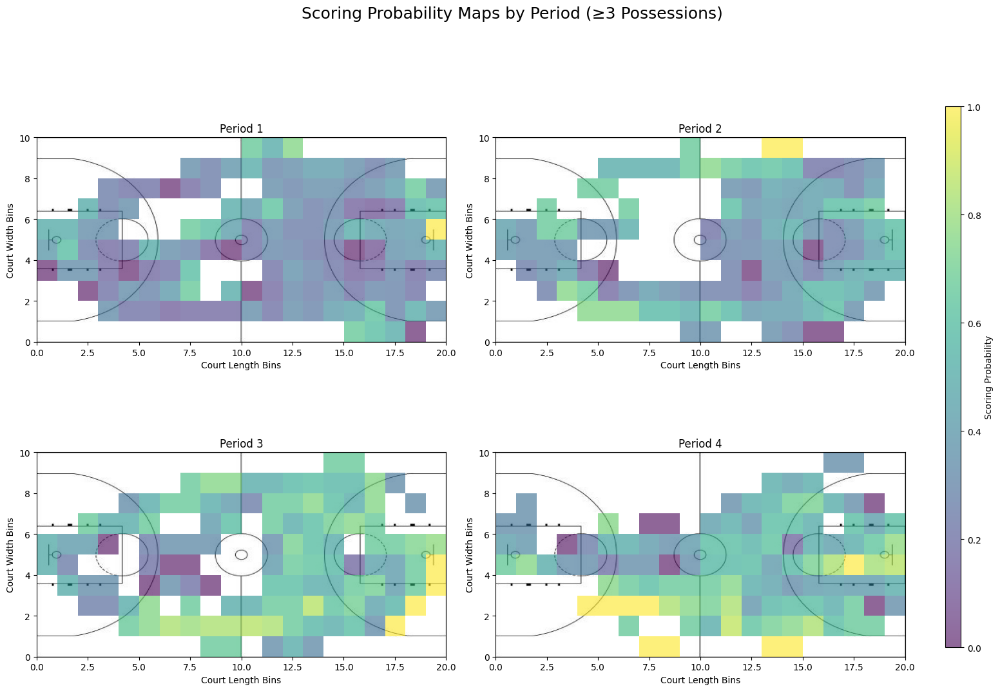
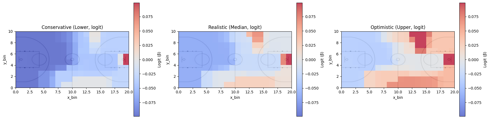
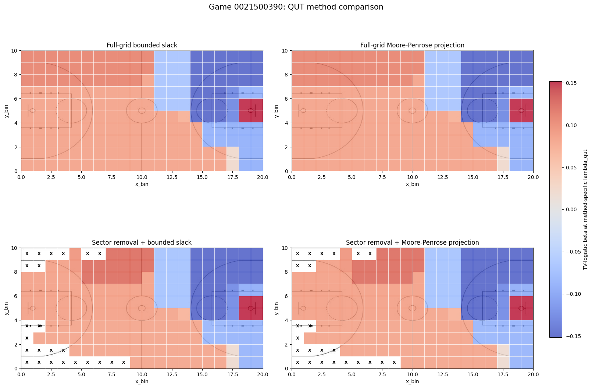
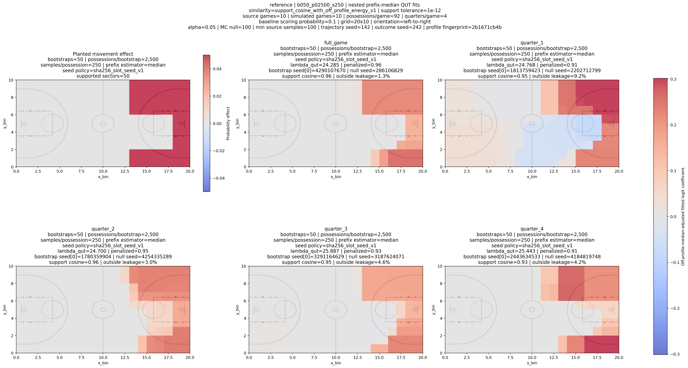
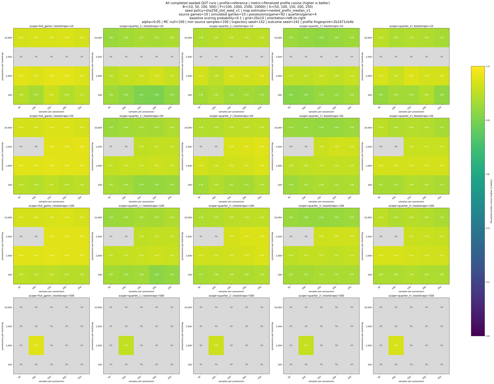

# Spatial Reconstruction of NBA Games with SportVU and Play-by-Play Data

This project reconstructs Toronto Raptors possessions from optical ball-tracking
coordinates and play-by-play records, then estimates where ball movement is
associated with scoring. The current research uses total-variation logistic
models and the Quantile Universal Threshold (QUT), tests two ways to make the
QUT optimization feasible, and checks recovery against known spatial effects
planted in simulations.

QUT is used here as a null-calibrated regularization threshold: an observed
`lambda_max` above `lambda_qut` indicates that the model found more spatial
structure than was produced by the fitted no-location-effect null model. This
is an exploratory spatial association study, not a causal model or a
player-evaluation metric.

## Current research workflow

1. **Reconstruct and audit possessions.** Correct possession clocks, reconcile
   outcomes with play-by-play, match tracking moments to corrected intervals,
   normalize attacking direction, and retain explicit quality flags.
2. **Estimate spatial signal.** Bin the court into a 20-by-10 grid and fit a
   total-variation logistic model at a QUT-selected penalty.
3. **Test feasibility choices.** Compare tightly bounded slack with a
   Moore-Penrose projection, both on the full grid and after low-coverage sector
   removal.
4. **Validate profile recovery.** Reuse real possession trajectories, plant
   known scoring surfaces, and measure how closely QUT recovers them over a
   range of bootstrap settings.

## Foundational single-game analysis

The extended project began with Pacers at Raptors on October 28, 2015 (game
`0021500009`). These results are useful as the origin of the research
questions, but they describe one game and should not be generalized to other
games or teams.

### Movement and conditional-probability observations

[`NBA_Analysis.ipynb`](./NBA_Analysis.ipynb) established the possession
reconstruction and 20-by-10 court representation used by the later notebooks.
Its current audit retains 103 Toronto possession records and 106 points. Three
stopped-clock records, containing five points, have no defensible movement
interval; the spatial analysis therefore contains 100 possessions, 101 points,
and 38,172 canonical tracking rows.

The exploratory plots motivated several later design choices:

- direct path plots were most useful for identifying tracking noise and
  implausible movement, rather than for drawing basketball conclusions;
- non-scoring possession heatmaps appeared more spatially dispersed than
  scoring-possession heatmaps;
- the quarter maps suggested weaker first-half scoring, stronger second-half
  activity around the basket, and more perimeter activity in quarter 4;
- conditional scoring maps were restricted to sectors visited by at least
  three possessions, but remained descriptive and sensitive to small counts;
  and
- the original two-crossing half-court rule removed 9 of 100 tracked
  possessions: 7 non-scoring and 2 scoring. That outcome imbalance motivated
  the explicit selection-bias audit and sensitivity cohorts in the updated
  multi-game cleaning.

The figure below shows the single-game conditional scoring rates after
left-to-right orientation. A colored sector was visited by at least three
possessions; the values are not adjusted estimates.



### First QUT observations

[`QUT_Boostrap.ipynb`](./QUT_Boostrap.ipynb) applied the first
total-variation QUT model to the legacy filtered version of the same game. Each
bootstrap sampled 1,000 possessions and 100 tracking positions per possession
with replacement. The initial full-game demonstration used 500 null
simulations and 500 bootstrap datasets:

| Scope | `lambda_qut` | Observed `lambda_max` | Bootstrap 95% interval | Null exceedances |
|---|---:|---:|---:|---:|
| Full game | 14.9718 | 32.4136 | [30.8450, 45.2627] | 0 / 500 |
| Quarter 1 | 17.0537 | 45.7185 | [36.9907, 50.9662] | 0 / 250 |
| Quarter 2 | 15.6475 | 51.2211 | [42.1968, 58.3238] | 0 / 250 |
| Quarter 3 | 14.0648 | 80.9860 | [78.6891, 93.7642] | 0 / 250 |
| Quarter 4 | 16.1653 | 72.7193 | [68.3480, 84.6769] | 0 / 250 |

The observed statistic exceeded the null threshold in the full-game and all
four quarter runs. Quarter 3 had the largest observed `lambda_max`, followed
by quarter 4, supporting the earlier visual impression of stronger
second-half spatial structure. These are finite single-game resampling results,
not evidence that the same quarter pattern holds generally.

The pointwise bootstrap maps showed that non-constant spatial structure
remained after applying the QUT penalty. This first implementation relied on
projecting the null gradient onto the total-variation column space to resolve
infeasibility. That methodological caveat became the subject of
`projections.ipynb`.



All nine plainly named foundational figures are available in
[`results/foundational-single-game/`](./results/foundational-single-game/).

## Data cleaning and the analysis cohort

[`multi_game_data/multi_game_analysis.ipynb`](./multi_game_data/multi_game_analysis.ipynb)
is the canonical multi-game cleaning notebook. Its current saved run covers ten
Raptors games and performs the following checks:

- shifts each segment start to the preceding full-game segment end and merges
  only 13 confirmed, one-point stopped-clock free-throw continuations;
- preserves original/source possession identifiers and their mapping to the
  corrected identifiers;
- corrects two opponent technical free throws that had been attributed to
  Toronto, reconciling the possession total from 1,001 to 999 points;
- joins physical tracking moments with the half-open clock rule
  `possession_end < clock <= possession_start`, collapses exact physical
  timestamp duplicates, and keeps one row per displayed game clock;
- rotates possessions to a common left-to-right attacking direction;
- retains long possessions while flagging them for review; and
- replaces the old automatic half-court-crossing exclusion with a primary
  all-represented cohort plus sustained-crossing and legacy-rule sensitivity
  cohorts.

### Cleaning audit

| Stage | Possessions | Points | Notes |
|---|---:|---:|---|
| Source Raptors segments | 915 | 1,001 | Before continuation merging and outcome reconciliation |
| Corrected possession metadata | 902 | 999 | 13 continuations merged; 2 scoring labels corrected |
| Spatially eligible | 894 | 986 | 8 stopped-clock possessions remain in metadata but have no spatial interval |
| Primary represented cohort | 882 | 968 | 12 eligible possessions have no matching tracking coverage |

The primary export contains **355,487 tracking rows**. Crossing behavior is a
diagnostic, not an exclusion criterion in the main analysis:

| Cohort | Possessions | Points | Scoring rate |
|---|---:|---:|---:|
| Primary: all represented | 882 | 968 | 51.5% |
| Sustained-crossing sensitivity | 820 | 939 | 53.9% |
| Legacy crossing-rule sensitivity | 760 | 903 | 55.9% |

The scoring-rate shift makes the selection effect visible instead of silently
building it into the primary sample. The notebook writes the primary and both
sensitivity datasets as separately named CSV files in
[`multi_game_data/`](./multi_game_data/).

## QUT feasibility comparison

[`projections.ipynb`](./projections.ipynb) compares four implementations of the
same QUT analysis:

- full grid with bounded slack;
- full grid with Moore-Penrose projection;
- low-visit/feasibility sector removal with bounded slack; and
- the same reduced grid with Moore-Penrose projection.

The projection removes the non-representable component of the null gradient;
bounded slack instead permits a tightly limited numerical residual. Both games
use shared bootstrap datasets within each comparison: 500 bootstraps, 1,000
possessions per bootstrap, 100 samples per possession, and a 20-by-10 grid.

| Game | Grid | `lambda_qut` | Observed `lambda_max` | Bootstrap 95% interval | Null exceedances |
|---|---|---:|---:|---:|---:|
| 0021500009 | Full | 14.9304 | 37.2142 | [30.5178, 43.9298] | 0 / 500 |
| 0021500009 | Reduced | 15.0654 | 38.4809 | [30.5260, 44.9336] | 0 / 500 |
| 0021500390 | Full | 15.7173 | 59.8711 | [47.4160, 62.4680] | 0 / 500 |
| 0021500390 | Reduced | 15.8729 | 59.8417 | [47.4086, 62.4109] | 0 / 500 |

For these two saved runs, bounded slack and projection match to the displayed
precision within each grid treatment. A zero empirical exceedance count means
none of the 500 simulated null statistics exceeded the observation; it does
not mean the population probability is exactly zero.

The shared color scale below makes the near-equivalence of bounded slack and
projection visible for game 0021500390. An `X` marks a sector omitted from the
reduced-grid models.



## Profile-recovery simulations

[`profile_sims.ipynb`](./profile_sims.ipynb) tests whether the analysis can
recover four known scoring profiles from real, left-to-right-oriented ball
trajectories: a reference pattern, high-y-side and low-y-side concentrations,
and a stepped perimeter pattern. Each synthetic game has 92 possessions and is
evaluated as a full game and as quarters 1 through 4.

The experiment uses deterministic seeds and nested bootstrap prefixes so that
smaller bootstrap counts are directly comparable with the matching prefix of a
larger run. Recovery is summarized with:

- **support similarity:** cosine similarity inside the planted region;
- **off-profile energy:** recovered signal outside that region; and
- **penalized profile similarity:** support similarity reduced by off-profile
  leakage, the primary ranking metric.

### Best completed settings in the published studies

Each row aggregates four profiles across five scopes. Similarity values closer
to 1 are better; off-profile energy is better when lower.

| Simulated games | Bootstraps | Possessions per bootstrap | Samples per possession | Mean penalized similarity | Mean support similarity | Mean off-profile energy | QUT rejections |
|---:|---:|---:|---:|---:|---:|---:|---:|
| 8 | 50 | 1,000 | 250 | 0.9013 | 0.9620 | 12.16% | 20 / 20 |
| 10 | 50 | 2,500 | 250 | 0.9114 | 0.9517 | 8.26% | 20 / 20 |

These rows are the top completed configuration within each published study,
not evidence that one game count or sampling budget is universally optimal.
Complete rankings and a searchable plot index are available in the
[`results/qut-profile-recovery/`](./results/qut-profile-recovery/) browser.

### Representative recovery map

The left panel is the planted reference effect. The remaining panels are the
median QUT coefficient maps for the full game and each quarter in the top-ranked
ten-game configuration.



### Sensitivity to simulation settings

This overview shows penalized profile similarity for every completed reference
profile configuration. Gray cells are combinations that were not run.



## Repository guide

| Path | Purpose |
|---|---|
| [`multi_game_data/multi_game_analysis.ipynb`](./multi_game_data/multi_game_analysis.ipynb) | Current ten-game cleaning, audit, cohort exports, and multi-game QUT analysis |
| [`projections.ipynb`](./projections.ipynb) | Four-way QUT feasibility and coefficient comparison on two games |
| [`profile_sims.ipynb`](./profile_sims.ipynb) | Planted-profile simulation design, resumable sweeps, maps, and rankings |
| [`results/foundational-single-game/`](./results/foundational-single-game/) | Plainly named movement, scoring-probability, and first-QUT figures |
| [`results/qut-method-comparison/`](./results/qut-method-comparison/) | Plainly named coefficient maps exported from the projection comparison |
| [`results/qut-profile-recovery/`](./results/qut-profile-recovery/) | Human-readable public heatmaps, indexes, and complete ranking tables |
| [`scripts/export_public_results.py`](./scripts/export_public_results.py) | Rebuilds the curated result tree from local simulation artifacts |
| [`scripts/export_foundational_figures.py`](./scripts/export_foundational_figures.py) | Re-extracts significant saved figures from the two single-game notebooks |
| [`scripts/export_projection_figures.py`](./scripts/export_projection_figures.py) | Re-extracts the saved projection-comparison figures |
| [`funcs.py`](./funcs.py) | Shared orientation, bootstrap, QUT, fitting, and plotting functions |
| [`NBA_Analysis.ipynb`](./NBA_Analysis.ipynb) | Foundational single-game cleaning and exploratory movement maps |
| [`QUT_Boostrap.ipynb`](./QUT_Boostrap.ipynb) | Earlier single-game QUT exploration retained for research history |

The public result hierarchy spells out each experimental count. For example,
`simulated-games-10__possessions-per-game-92/heatmaps/reference/bootstrap-count-0050/possessions-per-bootstrap-02500__samples-per-possession-0250.png`
contains all four sampling dimensions in its directory and file names.

## Running the notebooks

Run Jupyter from the repository root because notebook paths are relative to
this directory. Until the environment is pinned in a lock file, the principal
Python dependencies are Jupyter, NumPy, pandas, SciPy, scikit-learn,
Matplotlib, seaborn, CVXPY, tqdm, and Pillow. A typical setup is:

```powershell
python -m pip install jupyter numpy pandas scipy scikit-learn matplotlib seaborn cvxpy clarabel ecos scs tqdm pillow
jupyter lab
```

For the updated path through the project, read or run the multi-game cleaning
notebook first, then the projection comparison, and finally the profile
simulations. The projection and simulation cells are computationally
expensive; their saved notebook outputs and published CSV/PNG results can be
inspected without rerunning them.

After simulation artifacts exist locally, rebuild the audience-facing result
tree with:

```powershell
python scripts/export_public_results.py
```

The saved projection-comparison figures can be re-extracted without rerunning
the expensive model fits:

```powershell
python scripts/export_projection_figures.py
```

The foundational single-game figures use the same lightweight extraction
approach:

```powershell
python scripts/export_foundational_figures.py
```

Raw SportVU JSON files are intentionally ignored by Git. Place the single-game
file at the repository root and the ten multi-game files in
`multi_game_data/`, using the game-ID filenames expected by the notebooks.
The tracked possession CSVs document those IDs.

## Data lineage and limitations

- The newly cleaned primary cohort is
  `multi_game_data/multi_game_data_analysis_cohort.csv`. The published profile
  simulations and the two-game projection comparison were generated from the
  historical `multi_game_data_half_court_filtered.csv` inputs. Re-running those
  experiments on the 882-possession primary cohort is therefore a separate
  validation step, not something claimed by the current results.
- The ten-game simulation samples 920 trajectories from a 758-possession legacy
  source pool, so source trajectories are reused. The eight-game validation
  samples 736 trajectories from that pool without replacement.
- Tracking availability, possession construction, bin resolution, and finite
  Monte Carlo budgets all limit interpretation of the resulting maps.

The original tracking files are available through the community
[SportVU Logs archive](https://github.com/ethanweed/SportVu-Logs). Possession
parsing was adapted from
[Ryan Davis's NBA play-by-play parser](https://github.com/rd11490/NBA_Tutorials/tree/master/play_by_play).
The reconstruction and QUT methodology were inspired by the
[tomographic sports reconstruction paper](https://arxiv.org/pdf/2210.08312).
